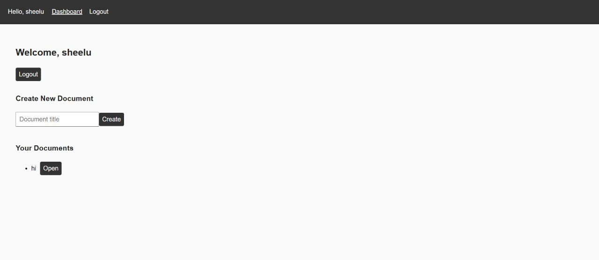
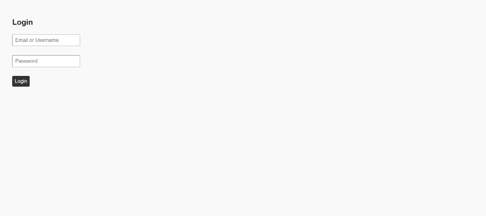
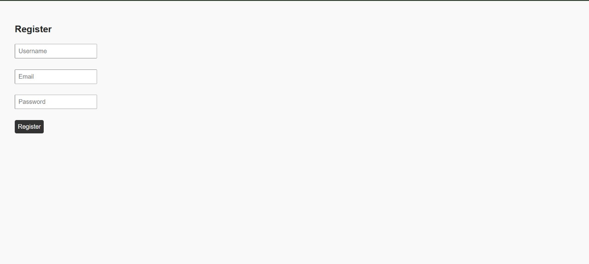
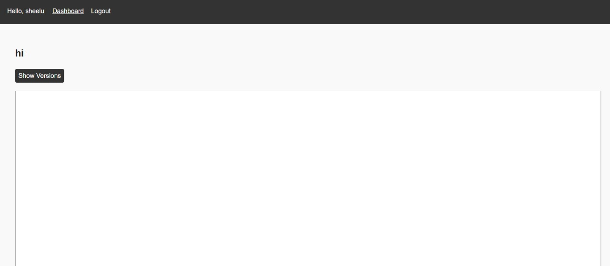

# Document Management System

A full-stack document management system built with React and Node.js.

## Project Structure

```
├── Backend/           # Node.js backend server
│   ├── src/          # Source code
│   │   ├── app.js    # Express application setup
│   │   ├── config/   # Configuration files
│   │   ├── controllers/ # API controllers
│   │   ├── middleware/ # Custom middleware
│   │   ├── models/    # Database models
│   │   ├── routes/    # API routes
│   │   ├── services/  # Business logic services
│   │   ├── socket/    # WebSocket functionality
│   │   ├── utils/     # Utility functions
│   │   └── server.js  # Main server file
│   ├── package.json   # Backend dependencies
│   └── package-lock.json
├── Frontend/         # React frontend application
│   ├── src/          # Source code
│   │   ├── App.css   # Global styles
│   │   ├── App.jsx   # Main component
│   │   ├── Components/ # Reusable components
│   │   ├── api/      # API integration
│   │   ├── assets/   # Static assets
│   │   ├── contexts/ # React contexts
│   │   ├── index.css # Global styles
│   │   ├── main.jsx  # Entry point
│   │   └── pages/    # Page components
│   ├── package.json  # Frontend dependencies
│   ├── package-lock.json
│   └── vite.config.js # Build configuration
├── results/          # Document storage
│   ├── result1.jpeg
│   ├── result2.jpeg
│   ├── result3.jpeg
│   └── result4.jpeg
└── .gitignore        # Git ignore rules
```

## Features

- Document upload and storage
- Document retrieval and display
- Real-time updates using WebSocket
- Modern React frontend with Vite
- RESTful API backend with Node.js
- Environment-based configuration

## Getting Started

### Prerequisites

- Node.js (v14 or higher)
- npm or yarn package manager

### Installation

1. Clone the repository
2. Install backend dependencies:
   ```bash
   cd Backend
   npm install
   ```
3. Install frontend dependencies:
   ```bash
   cd Frontend
   npm install
   ```

### Running the Application

1. Start the backend server:
   ```bash
   cd Backend
   npm start
   ```

2. Start the frontend development server:
   ```bash
   cd Frontend
   npm run dev
   ```


## Configuration

The application uses environment variables for configuration. You can find example configurations in the `.env.example` files in both Backend and Frontend directories.

## Results Directory

The `results` directory contains processed document images. This directory is intentionally included in version control to maintain document history and state.

## Project Organization

- Backend: RESTful API server with WebSocket support
- Frontend: Modern React application using Vite
- Results: Document storage directory
- Configuration: Environment-based configuration
- Documentation: This README file and inline code comments

## Contributing

1. Fork the repository
2. Create your feature branch
3. Commit your changes
4. Push to the branch
5. Create a Pull Request

## Project Screenshots

### Document Processing Examples


A logged-in dashboard displaying a welcome message, a form to create a new document, and a list of existing documents.


A simple login page prompting for email/username and password with a "Login" button.


A user registration page containing fields for username, email, and password with a "Register" button.


A document editing or viewing interface with a greeting, "Show Versions" button, and a large content area.